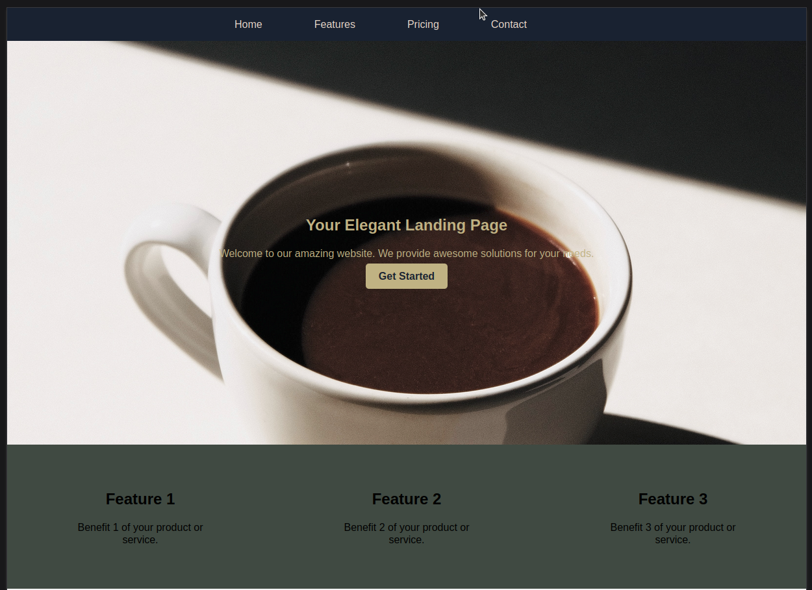
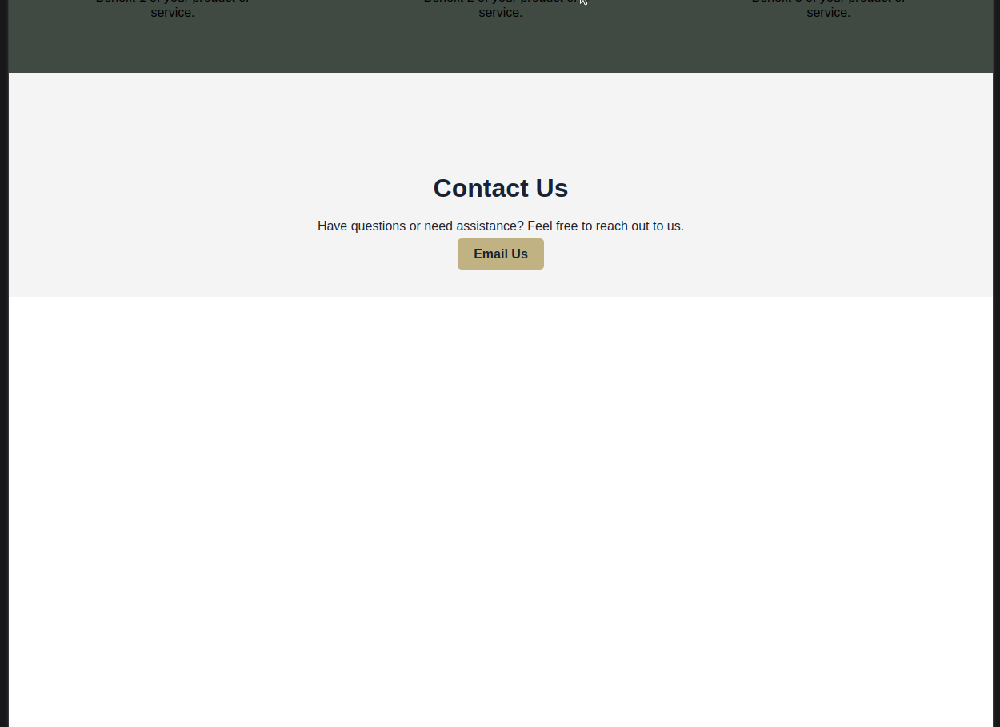
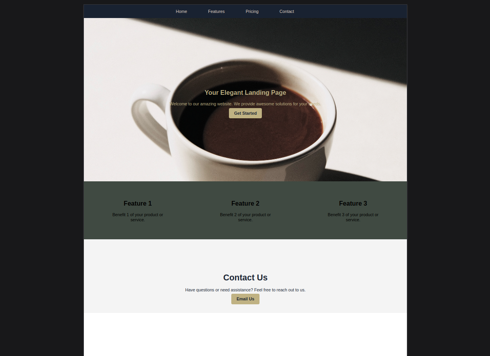

# Elegant Landing Page

This is a simple and elegant landing page created using HTML and CSS. It is designed to provide a clean and responsive interface for your website's visitors.

## Preview

## Features

- **Header Navigation**: Easily navigate through different sections of the landing page using the header navigation.

- **Hero Section**: A captivating hero section with a title, description, and a call-to-action button.

- **Feature Highlights**: Showcase key features or benefits using attractive icons and descriptions.

- **Contact Section**: A contact section with a call-to-action for users to get in touch with you.

## How to Use

1. Download the `index.html` and `styles.css` files.

2. Open `index.html` in your web browser to view the landing page.

3. Customize the content, styles, and images to match your own brand and message.

## Author

- Bruck Negash

Feel free to use and modify this template to create an elegant landing page for your website. Enjoy your web development journey!
