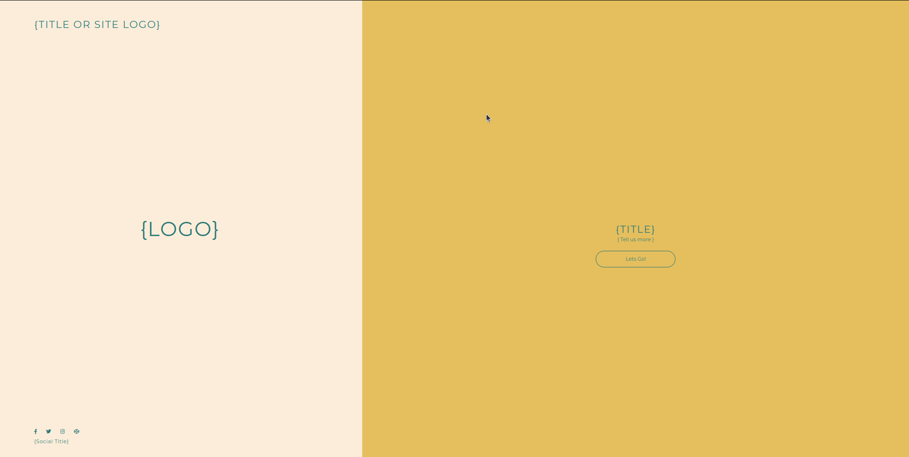

# Landing Page

This project is a simple landing page created using HTML and CSS. It features a two-column layout with a left column for navigation, social links, and a logo, and a right column for the main content.

## Preview

## Project Structure

- **Left Container**: The left column contains the navigation, site title or logo, and social links. The navigation includes a site title and a contact link. The social links are represented with icons, and there's a social title below them.

- **Right Container**: The right column holds the main content, including a title, a "Tell us more" section with decorative lines, and a "Let's Go!" button.

## Features

- **Responsive Design**: The landing page is designed to be responsive and adapt to different screen sizes, making it suitable for both desktop and mobile devices.

- **Elegant Styling**: The page features an elegant color scheme with well-designed typography and hover effects for links and buttons.

## Technologies Used

- HTML
- CSS
- Google Fonts (Montserrat)
- Font Awesome Icons

## Usage

1. Download or clone this project's HTML and CSS files.

2. Open the HTML file in your web browser to view the landing page.

## Author

- Bruck Negash

Feel free to personalize this README with your project details and author information. Enjoy working with your Landing Page project!
